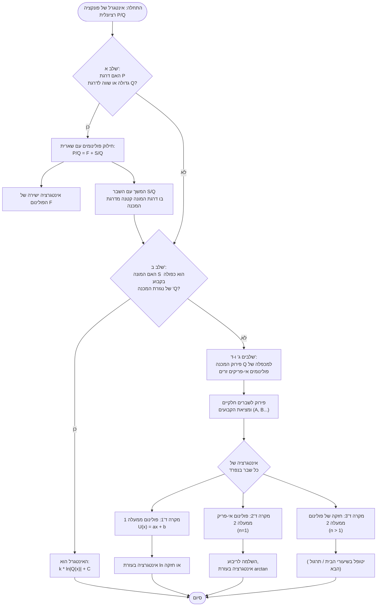

# חישוב פונקציה קדומה של פונקציה רציונאלית באמצעות פירוק לשברים חלקיים
הרעיון הבסיסי לחישוב פונקציה קדומה של [[ת2.1 פונקציה רציונאלית]] מהצורה 
$$
	f= \frac{P}{Q}
$$
הוא לפרק את המנה $\frac{P}{Q}$ **ל**סכום של פונקציות רציונאליות "פשוטות יותר"

נציג את האלגוריתם לחישוב פונקציה קדומה במקרה כזה.
### שלב א צמצום למצב בו דרגת המונה קטנה מדרגת המכנה
נסתכל על דרגת הפולינומים.
אם לא עוברים לשלב ב'
$$
	\deg P \geq \deg Q
$$
אם כן, עלינו לבצע [[1.1.9 חילוק של פולינום]]
נחלק את $P$ ב$Q$ עם שארית, ידוע כי מתקיים 
$$
	P(x) = Q(x)F(x)+S(x)
$$
כאשר כולם פולינומים  ו- 
$$
	\deg S < \deg Q
$$

חלוקה של שני האגפים ב$Q$ תביא אל 
$$
	\frac{P(x)}{Q(x)} = F(x) + \frac{S(x)}{Q(x)}
$$
וכך מלינאריות נקבל כי 
$$
	\int \frac{P(x)}{Q(x)}dx = \int F(x)dx + \int \frac{S(x)}{Q(x)}dx
$$

והרי 
$$
		\deg S < \deg Q
$$
ראו [[חישוב פונקציה קדומה של פונקציה רציונאלית באמצעות פירוק לשברים חלקיים#**דוגמא 1** שלב א מקרה בו|דוגמא 1]]

כעת כיסינו את כל המקרים ונוכל להמשיך לשלב ב'
### שלב ב
מעתה אנחנו נניח כי אנחנו עובדים כל הפונקציה הרציונלית $\frac{S}{Q}$ שבה דרגת המונה קטנה מדרגת המכנה. נבדוק אם $S$ הוא כפולה בקבוע של $Q'$ הנגזרת של המכנה.
 - אם לא נמשיך לשלב ג,
 - אם כן קיים $k \in \mathbb{R}$ כך ש 
   $$
   	S(x) = kQ'(x)
   $$
 - 

## דוגמאות
 #### **דוגמא 1**  שלב א מקרה בו 
$$
	\deg P \geq \deg Q
$$
$$
	\int \frac{x^3}{x^2 +3x +2} dx
$$
נבצע חלוקה עם שארית נגיע אל [[טכניקה - חילוק ארוך של פולינומים]]
$$
	 x^3 =  (x^2+3x +2)(x-3) + 7x \leftrightarrow \frac{x^3}{x^2 +3x +2}  = x-3 + \frac{7x}{x^2+3x+2}
$$

לכן הפונקציה הקדומה שקולה אל:
$$
\int \frac{x^3}{x^2 + 3x + 2} dx = \int (x - 3) dx + \int \frac{7x + 6}{x^2 + 3x + 2} dx = \frac{x^2}{2} - 3x + \int \frac{7x + 6}{x^2 + 3x + 2} dx
$$

## תרשים זרימה

## דגשים וטעויות נפוצות
* ## תרגילים קשורים