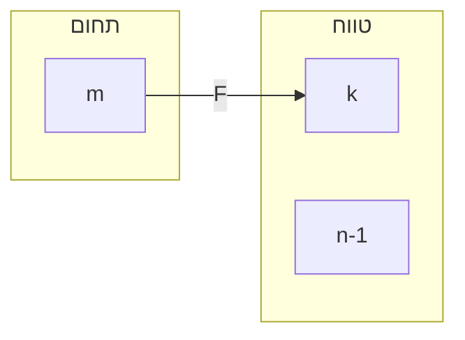
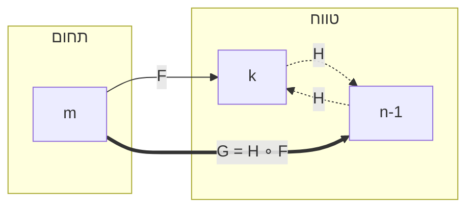

# טכניקת טרנספוזיציה (החלפת איברים) בהוכחות באינדוקציה על פונקציות

### מתי להשתמש?
* כאשר מוכיחים טענות על עוצמות של קבוצות סופיות, עקרון שובך היונים, או תכונות של פונקציות (חד-חד-ערכיות, על) באמצעות אינדוקציה.
* כאשר בשלב המעבר של האינדוקציה צריך לצמצם פונקציה לתחום קטן יותר (למשל מ-$[m+1]$ ל-$[m]$), אך "זריקת" איבר מהתחום יוצרת "חור" בטווח (למשל הטווח הופך ל-$[n] \setminus \{k\}$ במקום $[n-1]$). ה"חור" הזה מונע שימוש ישיר בהנחת האינדוקציה.

### למה זה עובד?
* הרכבה של שתי פונקציות חח"ע נותנת פונקציה חח"ע.
* פונקציית טרנספוזיציה $H$ (פונקציה שמחליפה בדיוק בין שני איברים ומשאירה את השאר במקום) היא תמיד הפיכה (ביגקציה). 
* על ידי הרכבת הפונקציה המקורית עם טרנספוזיציה על הטווח, אנו מבטיחים שהאיבר ה"בעייתי" יהיה בדיוק האיבר המקסימלי שנרצה לזרוק, מה שמשאיר אותנו עם טווח "נקי" שמתאים להנחת האינדוקציה.

---

### תרשים מצב: לפני ואחרי

**לפני ההחלפה (הפונקציה F):**
האיבר $m$ נשלח לאיבר $k$ כלשהו בטווח. צמצום (הסרה) של $m$ מהתחום ישאיר אותנו עם "חור" בטווח בנקודה $k$.

**אחרי ההחלפה (הפונקציה המורכבת G):**
פונקציית העזר $H$ מחליפה בין $k$ ל-$n-1$. הפונקציה המורכבת $G = H \circ F$ (החץ העבה) שולחת כעת את $m$ ישירות ל-$n-1$. צמצום של $m$ יזרוק את $n-1$, וישאיר רצף תקין.

---

### אלגוריתם עבודה
1. **זיהוי התמונה הבעייתית:** נניח שאנו רוצים לצמצם את תחום הפונקציה $F$ על ידי "זריקת" האיבר $m$. נבדוק מהי התמונה שלו ונסמן $F(m) = k$.
2. **הגדרת היעד בטווח:** נזהה איזה איבר אנחנו באמת צריכים לזרוק מהטווח כדי להתאים להנחת האינדוקציה (במקרה זה, $n-1$).
3. **בניית פונקציית ההחלפה (H):** נגדיר פונקציית עזר $H$ על הטווח:
   * $H(k) = n-1$
   * $H(n-1) = k$
   * לכל שאר האיברים $z \neq k, n-1$, נגדיר: $H(z) = z$.
4. **הרכבה:** נגדיר פונקציה מורכבת חדשה $G = H \circ F$. כעת מובטח לנו ש-$G(m) = n-1$.
5. **צמצום והפעלת הנחת אינדוקציה:** נצמצם את הפונקציה המורכבת $G$ לתחום ללא $m$. הטווח של הפונקציה המצומצמת יהיה הטווח המקורי ללא $n-1$. כעת ניתן להפעיל את הנחת האינדוקציה.